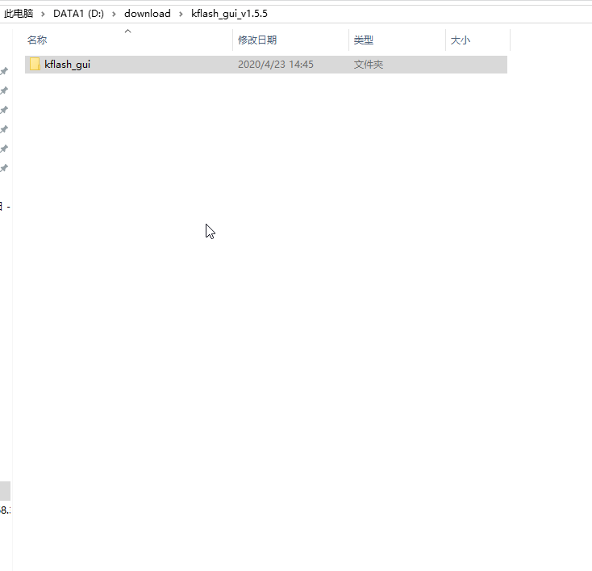
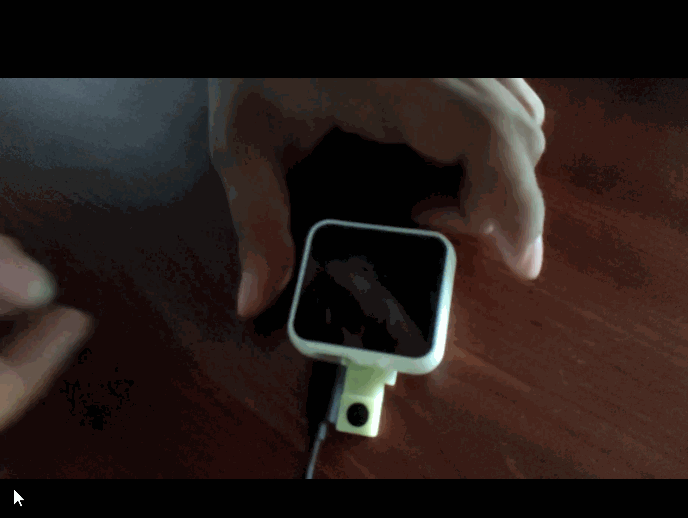

================
Getting started
================

Factory reset
================
This document guide guides users how to burn firmware and use the product

.. figure:: ../_static/dou.gif
   :scale: 90
   :align: left

.. figure:: ../_static/dou.gif
   :scale: 90
   :align: center

Steps
+++++++++++++
* :ref:`get-stared-build`
* :ref:`get-stared-config`
* :ref:`get-stared-download`
* :ref:`get-stared-use`

.. _get-stared-build:

1. Environment Setup
==========================

1.1 Install CP2104 driver
+++++++++++++++++++++++++++

* :download:`CP2104-Win10 <https://www.silabs.com/documents/public/software/CP210x_Universal_Windows_Driver.zip>`

1.2 Install the download tool IDE
++++++++++++++++++++++++++++++++++
.. figure:: ../_static/gui1.jpg
   :scale: 100
   :align: center

Download the installation package kflash_GUI: :download:`Click here to download <../download/kflash_gui_v1.5.5.zip>`

Open the folder after unzipping

Find kflash_gui.exe, double-click to open it directly

.. note::
    In order to facilitate the next use, it is recommended to save the exe file as a shortcut to the desktop

.. _get-stared-config:

2. Parameter introduction
==============================
.. figure:: ../_static/ggu.jpg 
   :scale: 100
   :align: center

``kflash_GUI`` See below for setting operation：

* ``开发板(Board)``：Select Auto, automatic configuration
* ``下载到(Download to)``：Select Flash and download to Flash
* ``端口(Port)``：Select the automatically generated COM port
* ``波特率(Baud)``：Choose 1500000
* ``速度模式(Speed mode)``：Choose low speed

.. important::
    If the COM port cannot be read, please check if the driver is installed

.. _get-stared-download:

3. Upload firmware
======================

3.1 Download factory firmware
++++++++++++++++++++++++++++++++++
First download the K210 firmware: :download:`Click here to download <../download/maixpy_v0.5.0-42-g458ed4ela-twatch.bin>`

3.2 Burn settings
++++++++++++++++++++++
.. figure:: ../_static/ggu.jpg 
   :scale: 100
   :align: center

* ``开发板(Board)``：Select Auto, automatic configuration
* ``下载到(Download to)``：Select Flash and download to Flash
* ``端口(Port)``：Select the automatically generated COM port
* ``波特率(Baud)``：Choose 1500000
* ``速度模式(Speed mode)``：Choose low speed

3.3 Start burning
++++++++++++++++++++++
.. figure:: ../_static/zz.gif
   :scale: 100
   :align: center

.. _get-stared-use:

4. Normal use
==============

After burning successfully, there will be three modes

4.1 Normal operation mode
++++++++++++++++++++++++++++

.. note::
    Just power on, the screen interface remains unchanged

4.2 Test mode
++++++++++++++++++++

The following operations are required to turn on the camera display

* ``1.Power supply``
* ``2.Press and hold the button next to the USB port`` 
* ``3.Let go when you see the screen light up``
 
.. figure:: ../_static/asd.gif
   :scale: 100
   :align: center

.. important::
    Remember to press the button after power on, otherwise it will enter upload mode

4.3 Upload mode
++++++++++++++++++++

Press and hold the button before power on to enter upload mode
But to avoid this

