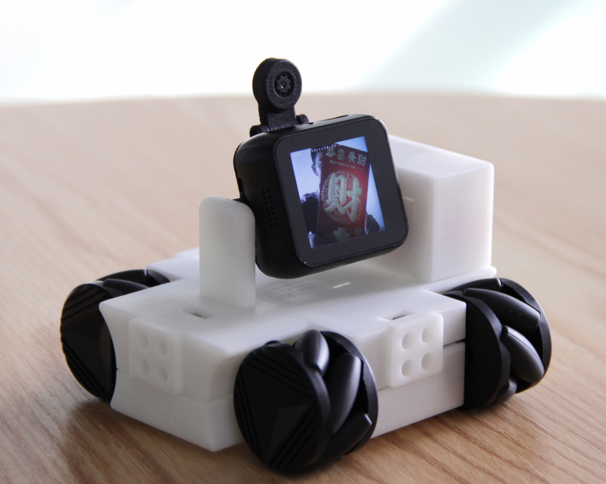

.. Arduino 编程指南 documentation master file, created by
   sphinx-quickstart on Fri Apr 19 14:10:11 2019.
   You can adapt this file completely to your liking, but it should at least
   contain the root `toctree` directive.

T-Watch K210 document
=======================

T-Watch-K210 programmable smart watch is the latest 
self-developed product launched by Shenzhen Xinyuan Electronics

.. toctree::
   :hidden:
   
   Introduction <introduction/index> 
   Get-started <get-started/index>
   Basics <basics/index>
   Download <download/index>
   Related-links <related-links/index> 

    