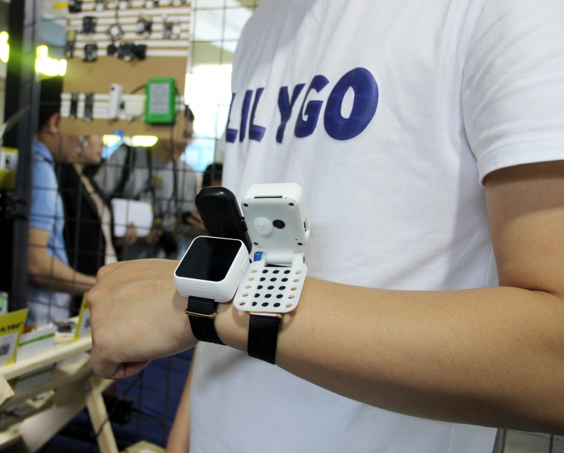

================
Introduction
================

1.Description
==================
T-Watch K210 is a programmable watch kit based on K210, consisting of three base plates and screens.You can program T-Watch K210 via Arduino or MicroPython.

2.Hardware parameters
========================
.. image:: ../_static/cat.jpg

- Main chip: **K210**
- 1.54-inch capacitive HD display: **ST7789V**
- Touchpad chip: **FT6236U**
- 2 million pixel HD camera: **OV2640**
- Three-axis accelerometer: **BMA423**
- Microphone: **MSM261S**
- Speaker: **Max98357A**
- PMU power management: **AXP202**
- RTC clock module: **PCF8563**
- 6-axis accelerometer: **MPU6050**
- Support TF card reading and writing
- Support the use of expandable modules
- Power supply: Type-C USB/lithium battery
  
2.1 K210
--------------
.. figure:: ../_static/i.png 
   :scale: 40
   :align: center

- **K210** Master：

  - With machine vision capabilities
  - With machine hearing ability
  - Better low-power vision processing speed and accuracy
  - Unique programmable IO array, making product design more flexible
  - 3.3V/1.8V dual voltage support, no level conversion required, saving cost
  - Support firmware encryption, which is difficult to crack using ordinary methods
  - CPU: equipped with dual-core 64-bit high-performance low-power CPU based on RISC-V ISA
  - Low voltage, lower power consumption compared with systems with the same processing capacity
  - TSMC 28nm advanced manufacturing process, temperature range -40°C to 125°C, stable and reliable
  - Equipped with a convolutional artificial neural network hardware accelerator KPU, which can perform convolutional artificial neural network operations with high performance

.. note::

  Kendryte K210 is a system-on-chip (SoC) that integrates machine vision and machine hearing capabilities. Use TSMC (TSMC) ultra-low power
  The 28-nanometer advanced manufacturing process, with dual-core 64-bit processor, has better performance, stability and reliability. The program strives to
  The development of zero gate biology can be deployed in the user's products in the shortest time and transform the product artificial intelligence.
  Kendryte K210 is positioned as an SoC in the AI and IoT market, and is a very convenient MCU.

3.Pin definition
====================

.. image:: ../_static/pin.jpg

3.1 Display
--------------
.. list-table:: 
   :widths: 15 10 20
   :header-rows: 1

   * - K210 
     - properties
     - description
   * - GPIO36
     - SPI
     - TFT_CS
   * - GPIO38
     - SPI
     - TFT_DC
   * - GPIO37
     - SPI
     - TFT_RST
   * - GPIO39
     - SPI
     - TFT_WR
   * - GPIO17
     - BL
     - TFT_BL

3.2 Touch
--------------

.. list-table:: 
   :widths: 15 10 20
   :header-rows: 1

   * - K210 
     - properties
     - description
   * - GPIO31
     - I2C
     - Touch_SDA
   * - GPIO30
     - I2C
     - Touch_SCL

3.3 TF Card
--------------

.. list-table:: 
   :widths: 15 10 20
   :header-rows: 1

   * - K210 
     - properties
     - description
   * - GPIO29
     - SPI
     - TF_CS
   * - GPIO28
     - SPI
     - TF_MOSI
   * - GPIO27
     - SPI
     - TF_MISO
   * - GPIO26
     - SPI
     - TF_SCLK
 
3.4 Camera:OV2640
------------------

.. list-table:: 
   :widths: 15 10 15
   :header-rows: 1

   * - K210 
     - properties
     - description
   * - GPIO42
     - DVP
     - DVP_RST
   * - GPIO43
     - DVP
     - DVP_VYNC
   * - GPIO44
     - DVP
     - DVP_PWDN
   * - GPIO45
     - DVP
     - DVP_HYNC
   * - GPIO46
     - DVP
     - DVP_XCLK
   * - GPIO47
     - DVP
     - DVP_PCLK
   * - GPIO40
     - DVP
     - DVP_SDA
   * - GPIO41
     - DVP
     - DVP_SCL

3.5 Microphone:MSM261S
---------------------------

.. list-table:: 
   :widths: 15 10 20
   :header-rows: 1

   * - K210 
     - properties
     - description
   * - GPIO18
     - I2S
     - MIC_BCK
   * - GPIO19
     - I2S
     - MIC_WS
   * - GPIO20
     - I2S
     - MIC_DAT

3.6 Interactive chip:ESP32
---------------------------------

.. list-table:: 
   :widths: 15 10 20
   :header-rows: 1

   * - K210 
     - properties
     - description
   * - GPIO25
     - SPI-CS
     - ESP32-IO05
   * - GPIO28
     - SPI-MOSI
     - ESP32-IO14
   * - GPIO26
     - SPI-MISO
     - ESP32-IO23
   * - GPIO27
     - SPI-SCLK
     - ESP32-IO18

3.7 Speaker:Max98357A
----------------------

.. list-table:: 
   :widths: 15 10 20
   :header-rows: 1

   * - K210 
     - properties
     - description
   * - GPIO35
     - I2S
     - MAX_BCK
   * - GPIO33
     - I2S
     - MAX_WS
   * - GPIO34
     - I2S
     - MAX_DAT

3.8 PMU:AXP202
--------------------

.. list-table:: 
   :widths: 15 10 20
   :header-rows: 1

   * - K210 
     - properties
     - description
   * - GPIO31
     - I2C
     - Touch_SDA
   * - GPIO30
     - I2C
     - Touch_SCL
   * - GPIO32
     - INT
     - AXP_IRQ

3.9 Six-axis accelerometer:MPU6050
--------------------------------------

.. list-table:: 
   :widths: 15 10 20
   :header-rows: 1

   * - K210 
     - properties
     - description
   * - GPIO31
     - I2C
     - MPU_SDA
   * - GPIO30
     - I2C
     - MPU_SCL